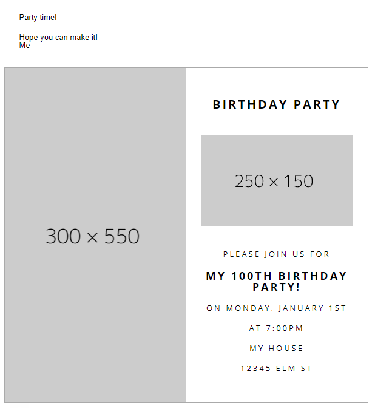

# Responsive Email Example

This is an example of using [MJML](https://mjml.io/) to generate a responsive email and [Nodemailer](https://nodemailer.com/) to send the email. I used this to send out birthday invites.

**Note:** Many email clients do not support custom imported fonts.

## Layout

* Simple two-column layout split 50%-50%
* Image on the left
* Invite details on the right
* On mobile, the columns are stacked on top of each other

## Preview

